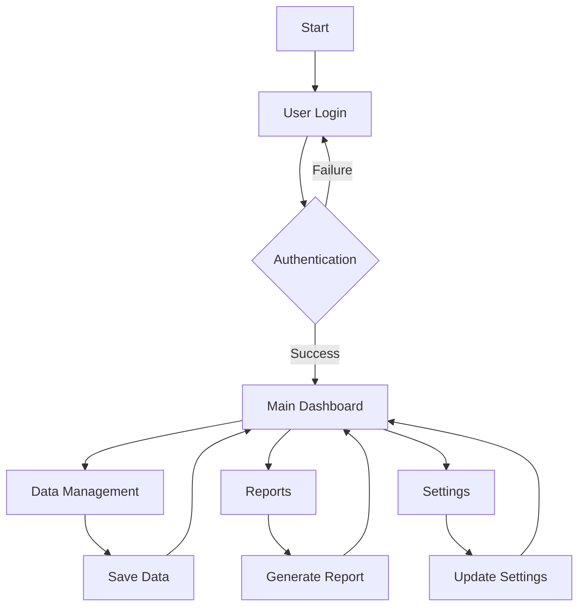

# Software Process Model Documentation
## MamaAbbys Android Application

## 1. Planning Phase

### 1.1 Project Scope and Objectives
- **Project Name**: MamaAbbys
- **Project Type**: Android Mobile Application
- **Primary Objective**: To provide a comprehensive mobile solution for managing and tracking various aspects of daily life and activities
- **Target Platform**: Android devices (mobile phones and tablets)

### 1.2 Stakeholders
1. **End Users**
   - Mobile application users
   - Individuals seeking to manage their daily activities

2. **Development Team**
   - Project Manager
   - Android Developers
   - UI/UX Designers
   - QA Engineers
   - Database Administrators

3. **Project Sponsors**
   - Business owners
   - Investors

### 1.3 Initial Requirements
1. **Functional Requirements**
   - User authentication and authorization
   - Data management and storage
   - Real-time updates
   - Offline functionality
   - Push notifications

2. **Non-Functional Requirements**
   - Performance optimization
   - Security measures
   - Scalability
   - Cross-device compatibility
   - Data backup and recovery

## 2. Analysis Phase

### 2.1 Business Requirements
1. **Core Business Processes**
   - User registration and profile management
   - Data entry and management
   - Report generation
   - Data synchronization
   - User activity tracking

2. **Business Rules**
   - Data validation rules
   - User access levels
   - Data retention policies
   - Security protocols

### 2.2 System Requirements
1. **Technical Requirements**
   - Android SDK compatibility
   - Minimum Android version support
   - Database requirements
   - Network connectivity
   - Storage requirements

2. **Integration Requirements**
   - Google Services integration
   - Third-party API integration
   - Cloud storage integration

### 2.3 Activity Diagram

## 3. Design and Testing Phase

### 3.1 User Interface (UI) Design
1. **Design Principles**
   - Material Design guidelines
   - Responsive layout
   - Intuitive navigation
   - Consistent color scheme
   - Accessibility compliance

2. **Key Screens**
   - Login/Registration
   - Dashboard
   - Data Entry Forms
   - Reports View
   - Settings

### 3.2 User Experience (UX) Design
1. **User Flow**
   - Onboarding process
   - Navigation patterns
   - Error handling
   - Feedback mechanisms

2. **Interaction Design**
   - Touch gestures
   - Animations
   - Loading states
   - Error messages

### 3.3 Database Design
1. **Database Schema**
   - User tables
   - Activity tables
   - Settings tables
   - Log tables

2. **Data Relationships**
   - One-to-many relationships
   - Many-to-many relationships
   - Foreign key constraints

### 3.4 Coding Standards
1. **Programming Languages**
   - Kotlin (Primary)
   - Java (Secondary)

2. **Code Organization**
   - MVVM Architecture
   - Repository Pattern
   - Dependency Injection
   - Clean Architecture principles

### 3.5 Testing Strategy
1. **Unit Testing**
   - Business logic testing
   - Data validation testing
   - API integration testing

2. **Integration Testing**
   - Component interaction testing
   - Database integration testing
   - Third-party service integration testing

3. **UI Testing**
   - Screen navigation testing
   - User interaction testing
   - Responsive design testing

4. **Performance Testing**
   - Load testing
   - Stress testing
   - Memory leak testing

## 4. Implementation Phase

### 4.1 Development Environment Setup
1. **Required Tools**
   - Android Studio
   - Git
   - Gradle
   - SQLite Database

2. **Development Workflow**
   - Version control
   - Code review process
   - Continuous Integration
   - Automated testing

### 4.2 Deployment Strategy
1. **Pre-deployment Checklist**
   - Code review completion
   - Test coverage verification
   - Performance optimization
   - Security audit

2. **Deployment Steps**
   - Build generation
   - Version management
   - Play Store submission
   - Production release

### 4.3 Post-Implementation
1. **Monitoring**
   - Error tracking
   - Performance monitoring
   - User feedback collection
   - Analytics tracking

2. **Maintenance**
   - Bug fixes
   - Feature updates
   - Security patches
   - Performance optimization

## 5. Documentation

### 5.1 Technical Documentation
- API documentation
- Database schema documentation
- Code documentation
- Architecture documentation

### 5.2 User Documentation
- User manual
- Installation guide
- Troubleshooting guide
- FAQ

### 5.3 Maintenance Documentation
- Deployment procedures
- Backup and recovery procedures
- Update procedures
- Security protocols 